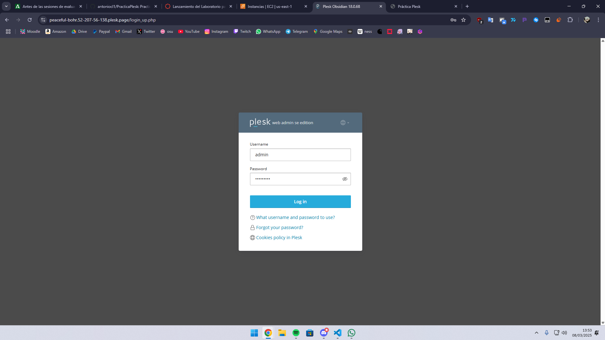

# PracticaPlesk

## Paso 1. Instalación de Plesk.
Se debe ejecutar el script (como sudo) que tenemos en el directorio de la práctica llamado **install_plesk.sh** con el siguiente contenido:
```bash
#!/bin/bash
set -ex

# Descargamos el script de instalación de Plesk
wget https://autoinstall.plesk.com/plesk-installer

# Le asignamos permisos de ejecución al script 
chmod +x plesk-installer 

# Ejecutamos el script de instalación
./plesk-installer install plesk
```
Esto tarda bastante, unos 15 minutos o por ahí.

## Paso 2. Comprobar mensaje de instalación exitosa.
Una vez ha terminado la instalación veremos un mensaje parecido a este:
```bash
Congratulations!

The installation has been finished. Plesk is now running on your server.

To complete the configuration process, browse either of URLs:
   * https://peaceful-bohr.52-207-56-138.plesk.page/login?secret=U3xViqQOTdJWrVmqQbix5y0Ny3GunGw4_nxgIvkZC19cWyrL
   * https://52-207-56-138/login?secret=U3xViqQOTdJWrVmqQbix5y0Ny3GunGw4_nxgIvkZC19cWyrL

Use the username 'admin' to log in. To log in as 'admin', use the 'plesk login' command.
You can also log in as 'root' using your 'root' password.

Use the 'plesk' command to manage the server. Run 'plesk help' for more info.

Use the following commands to start and stop the Plesk web interface:
'systemctl start psa.service' and 'systemctl stop psa.service' respectively.

If you would like to migrate your subscriptions from other hosting panel
or older Plesk version to this server, please check out our assistance
options: https://www.plesk.com/professional-services/
```
Debemos fijarnos en esas urls, si ya previamente habiamos instalado plesk podemos ver la url a la que nos tenemos que conectar haciendo:
```bash
plesk login
```


## Paso 3. Entrar a cualquiera de esas URLs
Vamos a acceder a cualquiera de las URLs que antes he mencionado y veremos el panel de inicio de sesión de Plesk porque ya lo tengo instalado.


## Paso 4. Crear los subdominios

